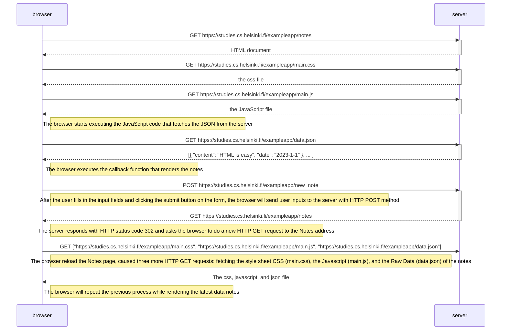

```mermaid
sequenceDiagram
    participant browser
    participant server
    
    browser->>server: GET https://studies.cs.helsinki.fi/exampleapp/notes
    activate server
    server-->>browser: HTML document
    deactivate server
    browser->>server: GET https://studies.cs.helsinki.fi/exampleapp/main.css
    activate server
    server-->>browser: the css file
    deactivate server
    browser->>server: GET https://studies.cs.helsinki.fi/exampleapp/main.js
    activate server
    server-->>browser: the JavaScript file
    deactivate server
    Note right of browser: The browser starts executing the JavaScript code that fetches the JSON from the server
    browser->>server: GET https://studies.cs.helsinki.fi/exampleapp/data.json
    activate server
    server-->>browser: [{ "content": "HTML is easy", "date": "2023-1-1" }, ... ]
    deactivate server
    Note right of browser: The browser executes the callback function that renders the notes
    
    browser->>server: POST https://studies.cs.helsinki.fi/exampleapp/new_note
    activate server    
    Note right of browser: After the user fills in the input fields and clicking the submit button on the form, the browser will send user inputs to the server with HTTP POST method    
    server-->>browser: GET https://studies.cs.helsinki.fi/exampleapp/notes
    deactivate server
    Note right of browser: The server responds with HTTP status code 302 and asks the browser to do a new HTTP GET request to the Notes address.
    browser->>server: GET ["https://studies.cs.helsinki.fi/exampleapp/main.css", "https://studies.cs.helsinki.fi/exampleapp/main.js", "https://studies.cs.helsinki.fi/exampleapp/data.json"]
    activate server
    Note right of browser: The browser reload the Notes page, caused three more HTTP GET requests: fetching the style sheet CSS (main.css), the Javascript (main.js), and the Raw Data (data.json) of the notes
    server-->>browser: The css, javascript, and json file
    Note right of browser: The browser will repeat the previous process while rendering the latest data notes
```
