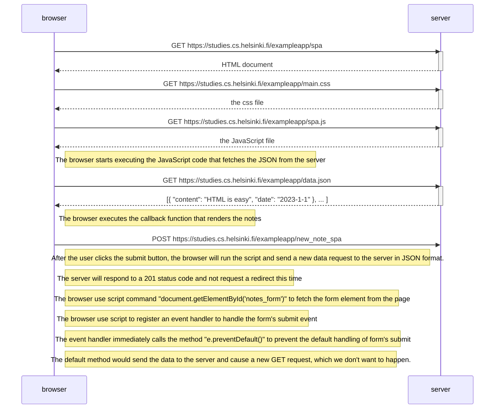

```mermaid
sequenceDiagram
    participant browser
    participant server
    browser->>server: GET https://studies.cs.helsinki.fi/exampleapp/spa
    activate server
    server-->>browser: HTML document
    deactivate server
    browser->>server: GET https://studies.cs.helsinki.fi/exampleapp/main.css
    activate server
    server-->>browser: the css file
    deactivate server
    browser->>server: GET https://studies.cs.helsinki.fi/exampleapp/spa.js
    activate server
    server-->>browser: the JavaScript file
    deactivate server
    Note right of browser: The browser starts executing the JavaScript code that fetches the JSON from the server
    browser->>server: GET https://studies.cs.helsinki.fi/exampleapp/data.json
    activate server
    server-->>browser: [{ "content": "HTML is easy", "date": "2023-1-1" }, ... ]
    deactivate server
    Note right of browser: The browser executes the callback function that renders the notes
    browser->>server: POST https://studies.cs.helsinki.fi/exampleapp/new_note_spa
    activate server
    Note right of browser: After the user clicks the submit button, the browser will run the script and send a new data request to the server in JSON format.
    Note right of browser: The server will respond to a 201 status code and not request a redirect this time
    Note right of browser: The browser use script command "document.getElementById('notes_form')" to fetch the form element from the page
    Note right of browser: The browser use script to register an event handler to handle the form's submit event
    Note right of browser: The event handler immediately calls the method "e.preventDefault()" to prevent the default handling of form's submit
    Note right of browser: The default method would send the data to the server and cause a new GET request, which we don't want to happen.
```
